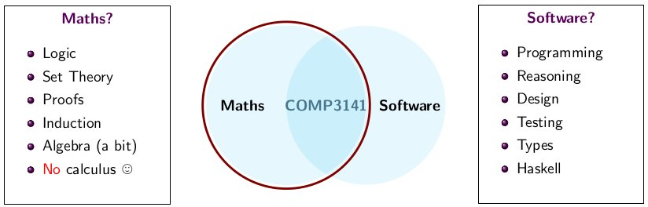
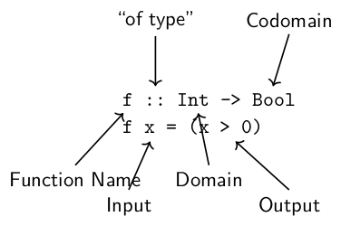

# Functional Programming

When developing software, we have a trade-off:  
Software must be high quality; **correct, safe, secure**  
Software must be developed **cheaply and quickly**

We have **safety-uncritical** applications like video games, where it is acceptable to have bugs in order to save developer effort.

We also have **safety-critical** applications; e.g. planes, self-driving cars, radiation therapy machines etc. A bug in the code controlling the Therac-25 radiation therapy machine was directly responsible for at least five patient deaths in the 1980s when it administered excessive quantities of beta radiation.

In this course we will use mathematics to guide the development of software



Why functional programming and how does it help?

1. **Close to Maths**: more abstract, less error-prone
2. **Types**: act as doc., the compiler eliminates many errors
3. **Property-based Testing**: QuickCheck (see [here](03_PBT-Lazy-Eval.md#property-based-testing))
4. **Verification**: equational reasoning eases proofs (see [here](TODO))

## Haskell

Haskell is a language with good support for mathematically structured programming.  
Like mathematical  functions, all functions in Haskell ***accept one argument and produce one result***



In mathematics, we would apply a function by writing *f(x)*. In Haskell we write `f x`.

Features of the Haskell language:

* Immutable data - no/less side-effects
* Declarative/Functional - specifies **what** is to be done instead of **how** to do it
* Easy to verify - can mathematically prove the correctness of programs
* Lazy evaluated - it evaluates things as they are needed e.g.

    ``` hs
    func arg =
      let x = func1 arg         -- evaluate z,
          y = func2 arg         -- if z is True,
          z = func3 arg         -- evaluate x,
      in if z then x else y     -- otherwise evaluate y
    ```

    See more on lazy evaluation [here](./03_PBT-Lazy-Eval.md#lazy-evaluation)

### Currying

**Currying** is a technique of transforming a function that takes multiple arguments in a tuple as its argument (i.e `f :: a -> b -> c` in curried form is `g :: (a, b) -> c`) into a function that takes just a **single argument** and returns another function which accepts further arguments, one by one, that the original function would receive in the rest of that tuple

In mathematics, we treat log10(x) and log2(x) and ln(x) as separate functions  
In Haskell, we have a single `logBase` that, given a number *n*, produces a function for logn(x)

``` hs
log10 :: Double -> Double
log10 = logBase 10

log2 :: Double -> Double
log2 = logBase 2

ln :: Double -> Double
ln = logBase 2.71828
```

The type of `logBase` is `logBase :: Double -> (Double -> Double)`, where parentheses are optional.

Function application associates to the **left** in Haskell, so  
logBase 2 64 ≡ (logBase 2) 64  

Consider a function with many arguments:

``` hs
f x1 x2 ... xn = y
-- where each xi is of type Int, y is of type Bool
-- The type of f is
f :: Int -> (Int -> ( ... (Int -> Bool)))
-- Correspondingly, we should write
(... ((f x1) x2) ...) xn = y
```

Haskell is aware of this and applies implicit bracketing from

* the right-to-left for function type declarations

    ``` hs
    f :: Int -> Int -> ... -> Int -> Bool
    -- means
    f :: Int -> (Int -> ( ... -> (Int -> Bool)))
    ```

* the left-to-right for function application

    ``` hs
    f x1 x2 ... xn
    -- means
    (... ((f x1) x2) ...) xn
    ```

Functions of more than one argument are usually written this way in Haskell, but it is possible to use **tuples** instead

### Tuples

**Tuples** are another way to take multiple inputs or produce multiple outputs:

``` hs
toCartesian :: (Double, Double) -> (Double, Double)
toCartesian (r, theta) = (x, y)
  where x = r * cos theta
        y = r * sin theta
```

Note that the order of bindings doesn't matter. Haskell functions have no side effects, they just return result.

### Higher Order Functions

A **higher order function** is a function which takes another functions as arguments

``` hs
twice :: (a -> a) -> (a -> a)
twice f a = f (f  a)

double :: Int -> Int
double x = x * 2

quadruple :: Int -> Int
quadruple = twice double

{- twice twice double 3 = 48
   (twice twice double) 3  - Equation 1
   (twice (twice double)) 3
   (twice quadruple) 3 - defn. of quadruple
   quadruple (quadruple 3) - Equation 1
-}
```

See [built-in higher order functions](#built-in-higher-order-functions) for more examples

### Strings

The type `String` in Haskell is just a list of characters

``` hs
type String = [Char]
```

This is a **type synonym**, like a `typedef` in C.  
Thus

``` hs
"hi!" == ['h', 'i', '!']
```

### Lists

Haskell makes extensive use of lists, constructed using square brackets. Each list element **must** be of the **same type**

``` hs
[True, False, True] :: [Bool]
[3, 2, 5+1] :: [Int]
[sin, cos] :: [Double -> Double]
[ (3,'a'), (4,'b') ] :: [(Int, Char)]
```

Haskell lists are *singly-linked* lists. Lists can be constructed by so-called constructors. There are two of them:

* `[]` - the empty list
* `x:xs` - the ***colon*** (or ***prepend*** or ***cons***). The `:` prepends any element `x` to an already existing list `xs`  
The value `x` is called the **head** and the rest of the list `xs` is called the **tail**. Thus

    ``` hs
    "hi!" == ['h', 'i', '!'] == 'h':('i':('!':[]))
                             == 'h' : 'i' : '!' : []
    ```

Functions on lists can be imported via `import Data.List`

When we define recursive functions on lists, we use the fast form for pattern matching:

``` hs
map :: (a -> b) -> [a] -> [b]
map f []     = []
map f (x:xs) = f x : map f xs
```

### Map

`map` is a useful function, which given a function, applies it to each element of a list

``` hs
map not [True, False, True] = [False, True, False]
map negate [3, -2, 4]       = [-3, 2, -4]
map (\x -> x + 1) [1, 2, 3] = [2, 3, 4]
```

The last example uses a ***anonymous functions*** to define a one-use function without giving it a name. The template for anonymous functions is: `(\<args> -> <expr>)`

The type of `map` is `map :: (a -> b) -> [a] -> [b]`

We can evaluate programs *equationally*

``` hs
map toUpper "hi!" ≡ map toUpper (’h’:"i!")
                  ≡ toUpper ’h’ : map toUpper "i!"
                  ≡ ’H’ : map toUpper "i!"
                  ≡ ’H’ : map toUpper (’i’:"!")
                  ≡ ’H’ : toUpper ’i’ : map toUpper "!"
                  ≡ ’H’ : ’I’ : map toUpper "!"
                  ≡ ’H’ : ’I’ : map toUpper (’!’:"")
                  ≡ ’H’ : ’I’ : ’!’ : map toUpper ""
                  ≡ ’H’ : ’I’ : ’!’ : map toUpper []
                  ≡ ’H’ : ’I’ : ’!’ : []
                  ≡ "HI!"                                       6
```

### Function Composition

We use **function composition** to combine our functions together. The mathematical (f ◦ g )(x) is written `(f . g) x` in Haskell.

In Haskell, operators like function composition are themselves functions. You can define your own operators

``` hs
-- Vector addition
(.+) :: (Int, Int) -> (Int, Int) -> (Int, Int)
(x1, y1) .+ (x2, y2) = (x1 + x2, y1 + y2)

(2,3) .+ (1,1) == (3,4)
```

You could even have defined function composition yourself if it didn't already exist:

``` hs
(.) :: (b -> c) -> (a -> b) -> (a -> c)
(f . g) x = f (g x)
-- f . g equiv. to (\x -> f (g x))
```

### Built-in Higher Order Functions

Various list functions that are built into Haskell's standard library

* `map` - see [map](#map). Given a function and list, apply the function to every element in the list

    ``` hs
    map :: (a -> b) -> [a] -> [b]
    map f []     = []
    map f (x:xs) = f x : map f xs
    ```

* `filter` - filters out a list given a predicate/condition. It returns a list that satisfies the predicate

    ``` hs
    filter :: (a -> Bool) -> [a] -> [a]
    filter p [] = []
    filter p xs = if p x then x : filter p xs
                         else p xs
    ```

* `concat` - concatenate a list of lists

    ``` hs
    concat :: [[a]] -> [a]
    concat []       = []
    concat (xs:xss) = xs ++ concat xss

    concat ["hello","world","!"] ≡ "hello":"world":"!":[]
                                 ≡ "hello"++"world"++"!"++[]
                                 ≡ "helloworld!"
    ```

* `sum` - sum a elements of a list

    ``` hs
    sum :: [Int] -> Int
    sum []     = 0
    sum (x:xs) = x + sum xs
    ```

* `foldr` given a binary operator, a starting value (typically the right-identity of the operator), and a list, it reduces the list using the binary operator from **right-to-left**.

    ``` hs
    foldr :: (a -> b -> b) -> b -> [a] -> b
    -- foldr (\elem  acc -> <term>) <start acc> <list>
    foldr f acc [] = z
    foldr f acc (x:xs) = x f (foldr f acc xs)
    ```

    This can be used to implement already existing list functions. Example:

    ``` hs
    sum = foldr (+) 0
    and = foldr (&&) True
    or  = foldr (||) False
    concat = foldr (++) []
    ```

* `foldl` does what `foldr` does but from **left-to-right**

    ``` hs
    foldl :: (b -> a -> b) -> b -> [a] -> b
    -- foldl (\acc elem -> <term>) <start acc> <list>
    foldl f acc [] = z
    foldl f acc (x:xs) = foldl f (f x acc) xs
    ```

### Miscellaneous Syntax

#### Notation

By default, alphanumerical functions use prefix notation. We can use **infix** notation by writing the function in backticks `` ` ``.

``` hs
div n 10 ≡ n `div` 10
mod n 10 ≡ n `mod` 10
```

Non-alphanumerical functions use infix notation. You can use prefix notation by enclosing the operator in brackets `()`.

``` hs
a + b ≡ (+) a b
f $ g ≡ ($) f g
```

#### `let ... in ...`

``` hs
toCartesian :: (Double, Double) -> (Double, Double)
toCartesian = \(r, theta) -> let
                               y = r * sin theta
                               x = r * cos theta
                             in (x, y)
```

#### `case` Statements

``` hs
case exp of
     Pattern1  -> action1
     Pattern2  -> action2
     _         -> else_action
```

Example:

``` hs
hello :: Pet -> String
hello x =
  case x of
    Cat -> "meeow"
    Dog -> "woof"
    Fish -> "bubble"
```

#### `if` Statements

The syntax for `if` expressions is:

``` hs
if <condition> then <true-value> else <false-value>
```

Example:

``` hs
fac :: Int -> Int
fac n =
  if n <= 1 then
    1
  else
    n * fac (n-1)
```

#### Guards

Guards are a way of testing whether some property of a value (or several of them) are true or false. Syntax for guards:

``` hs
f x
  | predicate1 = expression1
  | predicate2 = expression2
  | predicate3 = expression3
```

Example:

``` hs
fac :: Int -> Int
fac n
 | n <= 1    = 1
 | otherwise = n * fac (n-1)
```

`otherwise` is a constant that always evaluates to `True`

Guards resemble `switch` statements where they fall through to the condition they satisfy then exit the statement.

#### Dollar Sign

The `$` operator is an infix operator, which given a `a -> b` function and an `a` to apply it to, it gives us b.

``` hs
($) :: (a -> b) -> a -> b

-- the following are equivalent
f xs = map (\x -> x+1) (filter (\x -> x>1) xs)
f xs = map (\x -> x+1) $ filter (\x -> x>1) xs

f $ g = f (g x) = (f . g) x
```

It gives low, **right-associative** precedence

``` hs
f $ g $ h x  =  f (g (h x))
```

The difference between `($)` and `(.)`:  
`(.)` composes functions, while `($)` applies functions
`(.)` has higher precedence than `($)`

`a $ b $ c $ d` is `a $ (b $ (c $ d))`, but `a . b . c $ d` is `(a . (b . c)) $ d`.

#### Others

By convention, names that start with a lowercase letter are ***type variables***, and names that start with an uppercase letter are concrete types

Comments can be written as follows:

``` hs
-- I'm a single line comment
{-
   I'm a multi-
   line comment
-}
```

* `!!` is an indexing operator; `numList !! 2` gets the item at index 2
* `/=` is the not-equal operator
* `++` is a list concatenation operator

Operators can have different precedences over other operators, as well as being right-, left- or non-associative.

``` txt
+--------+----------------------+-----------------------+-------------------+
| Prec-  |   Left associative   |    Non-associative    | Right associative |
| edence |      operators       |       operators       |    operators      |
+--------+----------------------+-----------------------+-------------------+
| 9      | !!                   |                       | .                 |
| 8      |                      |                       | ^, ^^, **         |
| 7      | *, /, `div`,         |                       |                   |
|        | `mod`, `rem`, `quot` |                       |                   |
| 6      | +, -                 |                       |                   |
| 5      |                      |                       | :, ++             |
| 4      |                      | ==, /=, <, <=, >, >=, |                   |
|        |                      | `elem`, `notElem`     |                   |
| 3      |                      |                       | &&                |
| 2      |                      |                       | ||                |
| 1      | >>, >>=              |                       |                   |
| 0      |                      |                       | $, $!, `seq`      |
+--------+----------------------+-----------------------+-------------------+
```

Function application has the highest precedence (think precedence `10` in the table above).

You can find the type of functions on `ghci`/`stack repl` by using `:t`. E.g.

On `ghci`/`stack repl`:

* `:e` opens/creates a Haskell file
* `:i` display information about an operator/function
* `:l` loads a Haskell file
* `:r` runs loaded modules
* `:t` determine type of var. e.g. `:t True` gives `True :: Bool`

    ``` hs
    > :t map
    map :: (a -> b) -> [a] -> [b]
    ```

* `:!` runs a given shell command e.g. `:! clear`

Also see [week 1 wednesday code](../Wed-prac/week1.pdf).
