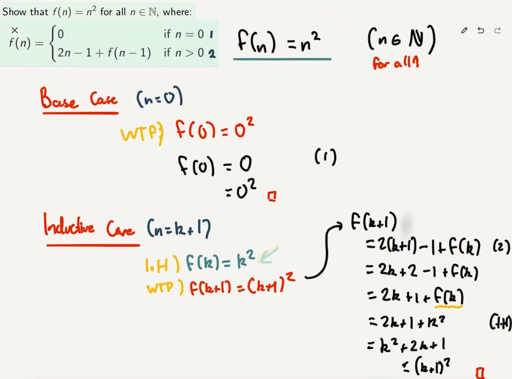
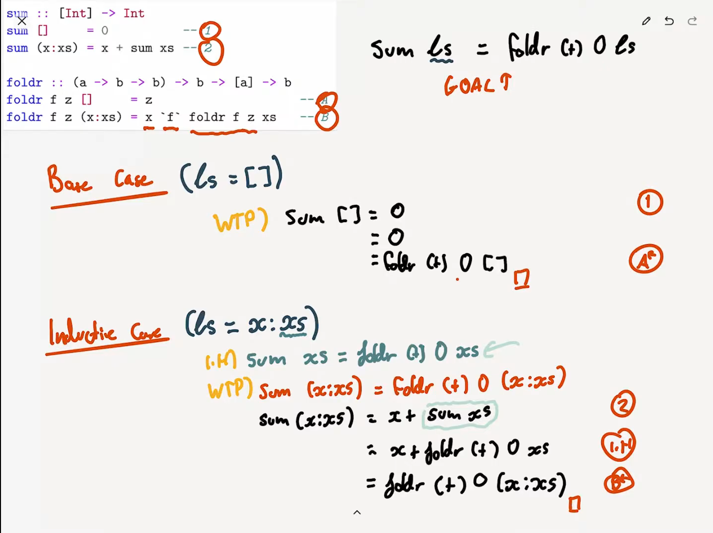
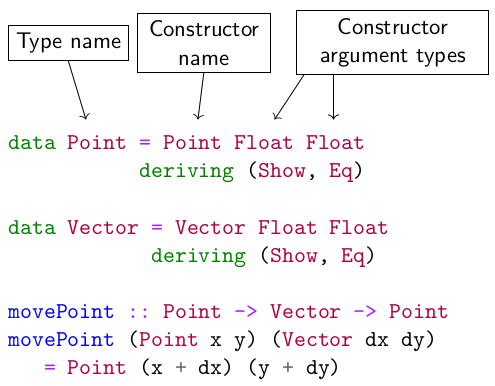

# Induction, Data Types and Classes

## Induction

Suppose we want to prove that a property *P(n)* holds for **all** natural numbers *n*.  
Remember that the set of natural numbers *N* can be defined as follows:

> Definition of Natural Numbers:
> (1) 0 is a natural number
> (2) For any natural number n, n+1 is also a natural number

Therefore, to show *P(n)* for all *n*, it suffices to show:

1. *P(0)* (the **base case**), and
2. assuming *P(k)* (the **inductive case**) ⇒ *P(k+1)* (the **inductive case**)

Example:



### Induction on Haskell Lists

Haskell lists can be defined similarly to natural numbers

> Definition of Haskell Lists:
> (1) `[]` is a list
> (2) For any list `xs`, `x:xs` is also a list (for any item `x`)

This means, if we want to prove that a property `P(ls)` holds for all lists `ls`, it suffices to show:

1. `P([])` (the base case)
2. `P(x:xs)` for all items `x`, assuming the inductive hypothesis `P(xs)`

Example:

``` hs
sum :: [Int] -> Int
sum []     = 0          -- 1
sum (x:xs) = x + sum xs -- 2

foldr :: (a -> b -> b) -> b -> [a] -> b
foldr f z []     = z                  -- A
foldr f z (x:xs) = x `f` foldr f z xs -- B

-- Prove for all ls:
sum ls == foldr (+) 0 ls
```



## Data Types

### Custom Data Types

So far, we have seen ***type synonyms*** using the `type` keyword. For a graphics library we might define:

``` hs
type Point  = (Float, Float)
type Vector = (Float, Float)
type Line   = (Point, Point)
type Colour = (Int, Int, Int, Int) -- RGBA

movePoint :: Point -> Vector -> Point
movePoint (x,y) (dx,dy) = (x + dx, y + dy)
```

But these definitions allow `Points` and `Vectors` to be used interchangeable, increasing the likelihood of errors. i.e we would not receive any errors if we passed a `Vector` as a `Point` and vice versa.

We can define out own compound types using the `data` keyword



Note: the type name and constructor name don't have to be the same  
Note: `deriving (Show, Eq)` means "make this printable and comparable"

#### Records

We could define Colour similarly:

``` hs
data Colour = Colour Int Int Int Int
```

But this has so many parameters, it's hard to tell which is which.

Haskell lets us declare these types as **records**, which is identical to the declaration type on `data`, but also gives us projection functions and record syntax:

``` hs
data Colour = Colour { redC     :: Int
                     , greenC   :: Int
                     , blueC    :: Int
                     , opacityC :: Int
                     } deriving (Show, Eq)
redC (Colour 255 128 0 255) -- gives 255
```

### Enumeration Types

Similar to `enums` in C and Java, we can define types to have one of a set of predefined values:

``` hs
data LineStyle = Solid
               | Dashed
               | Dotted
               deriving (Show, Eq)

data FillStyle = SolidFill | NoFill
               deriving (Show, Eq)
```

Types with more than one constructor are called **sum types**

Just as the `Point` constructor took two `Float` arguments, constructors for sum types can take parameters too, allowing us to model different kinds of shape:

``` hs
data PictureObject = Path    [Point]        Colour LineStyle
                   | Cirlce  Point Float    Colour LineStyle FillStyle
                   | Polygon [Point]        Colour LineStyle FillStyle
                   | Ellipse Point Float Float Float
                             Colour LineStule FillStyle
                   deriving (Show, Eq)

type Picture = [PictureObject]
```

### Recursive and Parametric Types

Data types can also be defined with ***parameters***, such as the well known `Maybe` type, defined in the standard library.

``` hs
data Maybe a = Just a | Nothing
```

Types can also be ***recursive***. If lists weren't already defined in the standard library, we could define them ourselves:

``` hs
data List a  = Nil | Cons a (list a)
```

We can even define natural numbers, where 2 is encoded as `Succ (Succ Zero)`:

``` hs
data Natural = Zero | Succ Natural
```

### Types in Design

Advice from Yaron Minsky (of Jane Street): **Make illegal states ***unrepresentable***.**

Choose types that *constrain* your implementation as much as possible. Then failure scenarios are eliminated automatically.

Example: We eliminate the failure state of no contact details

``` hs
data Contact = C Name (Maybe Address) (Maybe Email)
-- is changed to
data ContactDetails = EmailOnly Email
                    | PostOnly Address
                    | Both Address Email
data Contact = C Name ContactDetails
```

### Partial Functions

Failure to follow Yaron's advice leads to **partial functions**.

A **partial function** is a function that is not defined for all possible inputs.  
Examples: `head`, `tail`, `(!!)`, division

Partial functions are to be avoided, because they cause your program to crash if undefined cases are encountered.

To eliminate partiality, we must either:

* **enlarge** the codomain, usually with a `Maybe` type

    ``` hs
    safeHead :: [a] -> Maybe a
    safeHead (x:xs) = Just x
    safeHead []     = Nothing
    ```

* or we must **constrain** the domain to be more specific:

    ``` hs
    safeHead' :: NonEmpty a -> a
    ```

## Type Classes

We've seen functions that work on multiple types (e.g. `compare`, `(==)`, `(+)`, `show`) and their corresponding constraints on type variables (e.g `Ord`, `Eq`, `Num` and `Show`).  
These constraints are called **type classes**, and can be thought of as a *set of types* for which certain operations are implemented

### Show

The `Show` type class is a set of types that can be converted to strings. It is defined like:

``` hs
class Show a where -- class is not related to OOP
  show :: a -> String

-- Types are added to the type class as an instance like so
instance Show Bool where
  show True  = "True"
  show False = "False"

-- We can also define instances that depend on other instances
instance Show a => Show (Maybe a) where
  show (Just x) = "Just " ++ show x
  show Nothing  = "Nothing"
```

Haskell supports automatically `deriving` instances for some classes, including `Show`

### Read

Type classes can also ***overload*** based on the type returned, unlike similar features like Java's interfaces:

``` hs
class Read a where
  read :: String -> a

-- Examples:
read "34" :: Int           -- give 34 as an integer
read "22" :: Char          -- gives a runtime error
show (read "34") :: String -- gives a type error since show expects any time
                           --   ghci will convert it to a default value
                           --   but it is often not what we expect
```

### Semigroup

A **semigroup** is a pair of a set S and an operation `• : S → S → S`, where the operation • is **associative**.  
Associativity is defined as, for all a, b, c: `(a • (b • c)) = ((a • b) • c)`

Haskell has a type class for semigroups.  
The associativity law is enforced only by programmer discipline

``` hs
class Semigroup s where
  (<>) :: s -> s -> s
  -- Law: (<>) must be associative
```

Some associative operators include: `(++)`, `(+)`, `(*)`

Let's implement additive colour mixing:

``` hs
instance Semigroup Colour where
  Colour r1 g1 b1 a1 <> Colour r2 g2 b2 a2
    = Colour (mix r1 r2)
             (mix g1 g2)
             (mix b1 b2)
             (mix a1 a2)
    where mix x1 x2 = min 255 (x1 + x2)
-- observe that associativity is satisfied
```

#### Monoid

A **monoid** is a semigroup (S, •) equipped with a special ***identity element*** `z :: S` such that `x • z = x` and `z • y = y` for all x, y

``` hs
class (Semigroup a) => Monoid a where
  mempty :: a
```

For colours, the identity element is transparent black:

``` hs
instance Monoid Colour where
  mempty = Colour 0 0 0 0
```

There are multiple possible monoid instances for numeric types like `Integer`:

* The operation `(+)` is associative, with identity element 0
* The operation `(*)` is associative, with identity element 1

Haskell doesn't use any of these, because there can only be **one** instance per type per class in the ***entire program*** (including all dependencies and libraries used)

##### Newtypes

A common technique is to define a ***separate type*** that is represented identically to the original type, but can have its own, different type class instances.  
In Haskell, this is done with the `newtype` keyword

A `newtype` declaration is much like a `data` declaration except that there can be only **one constructor** and it must take exactly **one argument**:

``` hs
newtype Score = S Integer

instance Semigroup Score where
  S x <> S y = S (x + y)

instance Monoid Score where
  mempty = S 0
```

Here `Score` is represented identically to `Integer`, and thus no performance penalty is incurred to convert between them.  

***In general, `newtypes` are a great way to prevent mistakes***. Use them frequently

### Ord

`Ord` is a type class for ***inequality comparison***:

``` hs
class Order a where
  (<=) :: a -> a -> Bool
```

Instances should satisfy the following laws:

1. **Reflexivity**: `x <= x`
2. **Transitivity**: If `x <= y` and `y <= x`, then `x <= z`
3. **Antisymmetry**: If `x <= y` and `y <= x` then `x == y`
4. **Totality**: Either `x <= y` or `y <= x`

Relations that satisfy these four properties are called **total orders**.  
Without the fourth (totality), they are called **partial orders**. An example of this would be `(/)` (division). Two numbers don't necessarily divide each other

### Eq

`Eq` is a type class for **equality** or **equivalence**;

``` hs
class Eq a where
  (==) :: a -> a -> Bool
```

Instances should satisfy the following laws:

1. **Reflexivity**: `x == x`
2. **Transitivity**: If `x == y` and `y == z`, then `x == z`
3. **Symmetry**: If `x == y` then `y == x`

Relations that satisfies these are called **equivalence relations**  
Some argue that the `Eq` class should only be for *equality*, requiring stricter laws like:  
If `x == y` then `f x == f y` for all functions `f`  
But this is debated

## Functors

Haskell is actually comprised of ***two languages***  
The **value-level** language, consisting of expressions such as `if`, `let`, `3` etc.  
The **type-level** language, consisting of types `Int`, `Bool`, synonyms like `String`, and type ***constructors*** like `Maybe`, `(->)`, `[  ]` etc.

This type level language itself has a type system!

Just as terms in the value level language are given types, terms in the type level language are given **kinds**.  
The most basic kind is written as `*`.

Seeing as `Maybe` is parameterised by one argument, `Maybe` has kind `* -> *`  
Given a type (e.g. `Int`) it will return a type (`Maybe Int`)

### Lists

Suppose we have a function:

``` hs
toString :: Int -> String
```

And we also have a function to give us some numbers:

``` hs
getNumbers :: Seed -> [Int]
```

We can compose `toString` with `getNumbers` to get a function `f :: Seed -> [String]`

``` hs
f = map toString . getNumbers
```

### Maybe

Suppose we have a function:

``` hs
toString :: Int -> String
```

And we also have a function that ***may*** give us a number:

``` hs
tryNumber :: Seed -> Maybe Int
```

We can compose `toString` with `tryNumber` to get a function `f :: Seed -> Maybe String`  

``` hs
maybeMap :: (a -> b) -> Maybe a -> Maybe b
maybeMap f Nothing  = Nothing
maybeMap f (Just x) = Just (f x)
-- alternatively it can be written as
maybeMap f mx = case mx of
                  Nothing -> Nothing
                  Just x  -> Just (f x)

f = maybeMap toString . tryNumber
```

### Functors Explained

All these functions (i.e `maybeMap`, `map`) are in the interface of a single type class called `Functor`

``` hs
class Functor f where
  fmap :: (a -> b) -> f a -> f b
```

Unlike previous type classes we've seen like `Ord` and `Semigroup`, `Functor` is over types of kind `* -> *`

Instances for:

* lists
* `Maybe`
* Tuples

    ``` hs
    -- type level:
    -- (,) :: * -> (* -> *)
    -- (,) x :: * -> *

    instance Functor ((,) x) where
    --  fmap :: (a -> b) -> f a -> f b
    --  fmap :: (a -> b) -> (,) x a -> (,) x b
    --  fmap :: (a -> b) -> (x, a) -> (x, b)
      fmap f (x,a) = (x, f a)
    -- the functor instance for tuples just applies
    -- the function to the right-hand side of the tuple
    ```

* Functions

    ``` hs
    -- type level:
    -- (->) :: * -> (* -> *)
    -- (->) x :: * -> *

    instance Functor ((->) x) where
    --  fmap :: (a -> b) -> f a -> f b
    --  fmap :: (a -> b) -> (->) x a -> (->) x b
    --  fmap :: (a -> b) -> (x -> a) -> (x -> b)
      fmap = (.)
    -- the functor instance of (->) simply composes functions
    ```

### Functor Laws

The functor type class must obey two laws:

> (1) Idenity Law: `fmap id == id`
> E.g. if the identity function is applied to every element in a structure (e.g. a list) we'd get the same structure back
> (2) Composition Law: `fmap f . fmap g == fmap (f . g)`
> E.g. if we apply g on every element in a structure (e.g. a list), the we apply g on every element. this should be equivalent to applying (f . g) on every element on the structure

In Haskell's type system, it's impossible to make a total `fmap` function that satisfies the first law but violated the second.  
In other words, ***if one law is satisfied, then the other law is also satisfied***.

This is due to [parametricity](TODO)
