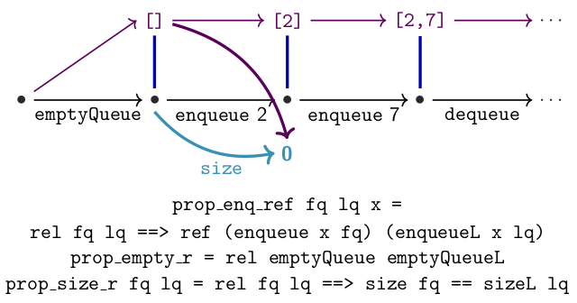

# Data Invariants, Abstraction and Refinement

## Modules

A Haskell program will usually be made up of many **modules**, each of which exports one or more **data types**.  
Typically a modules for a data type `X` will also provide a set of functions, called **operations**, on `X`:

* to construct the data type: `c :: ... -> X`
* to query information from the data type: `q :: X -> ...`
* to update the data type: `u :: ... X -> X`

A lot of software can be designed with this structure.

## Data Invariants

One source of properties is **data invariants**

> **Data invariants** are properties that pertain to a particular data type. They are statements that must always be true for a data structure  
> Whenever we use operations on that data type, we want to know that our data type invariants are maintained

For a given data type `X`, we define a **wellformedness predicate**, a function that tests whether a value is well-formed:  
`wf :: X -> Bool`  
For a given value `x :: X`, `wf` returns `True` iff our data invariants hold for the value `x`

> For each operation, if all input values of type `X`satisfy `wf`, all output values will satisfy `wf`  
> In other words for each constructor operation `c :: ... -> X`, we must show `wf (c ...)`, and for each update operation `u :: X -> X`, we must show `wf x` ⇒ `wf (u x)`

## Abstract Data Types

An **abstract data type (ADT)** is a data type where the implementation details of the type and its associated operations are hidden. We encapsulate the implementation of a data type by restricting access to which functions can be used to construct, query, or transform a value from *outside* the module in which it is defined. This is useful when we want to stop malicious or clueless programmers from going in and mucking up our data invariants.

``` hs
newtype Dict
type Word       = String
type Definition = String
emptyDict   :: Dict
insertWords :: Word -> Definition -> Dict -> Dict
lookup      :: Word -> Dict -> Maybe Definition
```

If we don't have access to the implementation of `Dict`, then we can only access it via the provided operations, which we know preserve our data invariants. Thus, our data invariants cannot be violated if this module is correct.

In general, **abstraction** is the process of ***eliminating detail***  
The inverse of abstraction is called **refinement**

Abstract data types like the dictionary above are abstract in the sense that their implementation details are hidden, and we no longer have to reason about them on the level of implementation.

### Validation

Suppose we had a `sendEmail` function

``` hs
sendEmail :: String -- email address
          -> String -- message
          -> IO ()  -- action
```

It is possible to mix the two `String` arguments, and even if we get the order right, it's possible that the given email address is not valid.

We could define a tiny ADT for validated email addresses, where the data invariant is that the contained email address is valid.

``` hs
module EmailADT(Email, checkEmail, sendEmail)
newtype Email = Email String
checkEmail :: String -> Maybe Email
checkEmail str | '@' `elem` str = Just (Email str)
               | otherwise      = Nothing
```

Then change the type of `sendEmail` to `sendEmail :: Email -> String -> IO()`

The only way (outside the `EmailADT` module) to create a value of type `Email` is to use `checkEmail`  
`checkEmail` is an example of what we call a **smart constructor**; a constructor that enforces data invariants

## Data Refinement

**Refinement** is a relation from an *implementation* to an *abstract model* or an *abstract specification*. A refinement is the opposite of an abstraction (which removes detail).  
If an implementation ***refines*** a model or specification, it exhibits all of the same behaviour but may have additional behaviour or detail.

In this course, the model and implementation will have an indistinguishable interface with different implementation details

We can demonstrate a **refinement relation** between two data types if we can show that the interfaces are the same and they exhibit the same behaviour. This is a **data refinement**.

We choose which data type will be the *abstract model*, which is the *definition* or ***specification***. The other data type the becomes are *implementation*; i.e. the data type that we will actually use in the final system.  
We must show the implementation is a refinement of the model or specification

### Reasoning about ADTs

Consider the following, more tradition example of an ADT interface, the unbounded queue:

``` hs
data Queue

emptyQueue :: Queue
enqueue    :: Int -> Queue -> Queue
front      :: Queue -> Int   -- partial
dequeue    :: Queue -> Queue -- partial
size       :: Queue -> Int
```

We could try to come up with properties that relate these functions to each other without reference to their implementation, such as:  
    `dequeue (enequeue x emptyQueue) == emptyQueue`  
However, these do not capture functional correctness (usually)

### Models for ADTS

We could imagine a simple implementation for queues, just in terms of lists:

``` hs
emptyQueueL = []
enqueueL    = (++ [a])
frontL      = head
dequeueL    = tail
sizeL       = length
```

This implementation is O(n), which is sub-par.  
***However***, it is a simple implementation, and its trivial to see that it is correct. If we make a better queue implementation, it should always give the same results as this simple one.  
Therefore: this implementation serves as a **functional correctness specification** for our `Queue` type

### Refinement Relations

The typical approach to connect our model queue to our `Queue` is to define a relation, called **refinement relation**, that relates a `Queue` to a list and tells us if the two structures represent the same queue conceptually:

``` hs
rel :: Queue -> [Int] -> Bool
```

Then, we show that the refinement relation holds up initially:

``` hs
prop_empty_r = rel emptyQueue emptyQueueL
```

That any query functions for our two types produce equal results for the related inputs, such as for size:

``` hs
prop_size_r fq lq = rel fq lq ==> size fq == sizeL lq
```

And that each of the queue operations preserves our refinement relation, for example for enqueue:

``` hs
prop_end_ref fq lq = rel fq lq ==> rel (enqueue x f) (enqueueL x lq)
```

In pictures, whenever we use a Queue, we can reason as if it were a list:



### Abstraction Functions

These refinement relations are very difficult to use with QuickCheck because `rel fq lq` preconditions are very hard to satisfy with randomly generated inputs.

For this example, it's a lot easier if we define an abstraction function that compute the corresponding **abstract** list from the **concrete** Queue

``` hs
toAbstract :: Queue -> [Int]
```

Conceptually, our refinement relation is then just:

``` hs
\fq lq = absfun fq == lq
```

However, we can re-express our properties in a much more QuickCheck-friendly format

Let’s use test-driven development! We’ll implement a fast Queue with amortised O(1) operations.

``` hs
data Queue = Q [Int] -- front of the queue
               Int   -- size of the front
               [Int] -- rear of the queue
               Int   -- size of the rear
```

We store the rear part of the queue in **reverse order**, to make enqueueing easier.  
Thus, converting from our Queue to an abstract list requires us to reverse the rear:

``` hs
toAbstract :: Queue -> [Int]
toAbstract (Q f sf r sr) = f ++ reverse r
```

### Data Refinement Explained

These kinds of properties establish what is known as **data refinement** from the **abstract**, slow, list model to the fast, **concrete** `Queue` implementation

> **Refinement and Specification**  
> In general, all **functional correctness specifications** can be expressed as:
>
> 1. all data invariants are maintained, and
> 2. the implementation is a refinement of an abstract correctness model

There is a limit to the amount of abstraction we can do before they become useless for testing (but not necessarily for proving)

**Warning**: while abstraction can simplify proofs, abstraction does not reduce the fundamental complexity of verification, which is provably hard.

### Queue Example ctd.

In addition to the already-stated refinement properties, we also have some data invariants to maintain for a value `Q sf r sr`

1. `length f == sf`
2. `length r == sr`
3. **important**: `sf >= sr` - the front of the queue cannot be shorter than the rear

We will ensure our `Arbitrary` instance only every generates values that meed these invariants.

Thus our `wellformed` predicate is used merely to enforce these data invariants on the output of our operations

``` hs
prop_wf_empty = wellformed (emptyQueue)
prop_wf_enq q = wellformed (enqueue x q)
prop_wf_deq q = size q > 0 ==> wellformed (dequeue q)
```

#### Implementing the Queue

We will generally implement by:

* Dequeue from the front.
* Enqueue to the rear.
* If necessary, re-establish the third data invariant by taking the rear, reversing it, and appending it to the front.  
This step is slow (O(n)), but only happens every n operations or so, giving an average case amortised complexity of O(1) time.

``` hs
enqueue x (Q f sf r sr) = inv3 (Q f sf (x:r) (sr + 1))
-- when we enqueue each of [1..7] to the emptyQueue in turn:

Q []                    0 []        0
Q [1]                   1 []        0 (∗)
Q [1]                   1 [2]       1
Q [1, 2, 3]             3 []        0 (∗)
Q [1, 2, 3]             3 [4]       1
Q [1, 2, 3]             3 [5, 4]    2
Q [1, 2, 3]             3 [6, 5, 4] 3
Q [1, 2, 3, 4, 5, 6, 7] 7 []        0 (∗)
```

Observe that the slow invariant-re-establishing step `(*)` happens after 1 step, then 2, then 4... Extended out, this averages to O(1)

### Refinement Functions

Consider this ADT interface for bag of numbers:

``` hs
data Bag
emptyBag   :: Bag
addToBag   :: Int -> Bag -> Bag
averageBag :: Bag -> Maybe Int
```

Our conceptual abstract model is just a list of numbers:

``` hs
emptyBagA      = []
addToBagA x xs = x:xs
averageBagA [] = Nothing
averageBagA xs = Just (sum xs `div` length xs)
```

But we don't need to keep track of all that information in our implementation

Our concrete version will just maintain two integers, the `total` and the `count`:

``` hs
data Bag = B { total :: Int , count :: Int }
emptyBag :: Bag
emptyBag = B 0 0

addToBag :: Int -> Bag -> Bag
addToBag x (B t c) = B (x + t) (c + 1)

averageBag :: Bag -> Maybe Int
averageBag (B _ 0) = Nothing
averageBag (B t c) = Just (t `div` c)
```

Normally, writing an abstraction function (as we did for `Queue`) is a good way to express refinement relation in a QuickCheck-friendly way. In this case, however, it's hard to write such a function:

``` hs
toAbstract :: Bag -> [Int]
toAbstract (Bag t c) = ???
```

Instead, we will go in the other direction, giving us a **refinement function**:

``` hs
toConc :: [Int] -> Bag
toConc xs = B (sum xs) (length xs)
```

**Refinement functions** produce properties much like abstraction functions, only with the abstract and concrete layers swapped:

``` hs
prop_ref_empty    = toConc emptyBagA == emptyBag
prop_ref_add x ab = toConc (addToBagA x ab) == addToBag x (toConc ab)
prop_ref_avg ab   = averageBagA ab == averageBag (toConc ab)
```
