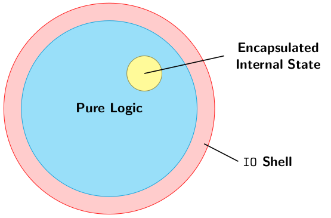

# Effects and State

## Effects

**Effects** are observable phenomena from the execution of a program.  
Examples:

* memory effects

    ``` c
    int *p = ...
    ... // read and write
    *p = *p + 1
    ```

* IO

    ``` c
    // console IO
    c = getchar();
    printf("%d", 32);
    ```

* non-termination

    ``` c
    // infinite loop
    while (1) {};
    ```

* control flow

    ``` c
    // exception effect
    throw new Exception();
    ```

An **external effect** is an effect that is ***observable*** outside the function.  
The observer doesn't necessarily have to be a user; it can be other functions.  
Examples: console, file and network IO; termination and non-termination; non-local control flow; modifying global variables etc.  
**Internal effects** are not observable from outside. They are contained within the function that is doing them  
Examples: modifying local variables

Memory effects can be internal or external depending on the scope of memory being accessed. Global memory accesses are *external*

### Purity

A function with ***no external effects*** (beyond its return value) is called a **pure function**.

> A **pure function** is the mathematical notion of a function. That is, a function of type `a -> b` is *fully* specified from all elements of the domain type `a` to the codomain type `b`

Consequences:

* two invocations with the same argument result in the same value
* no observable trace is left beyond the result of the function
* no implicit notion of time or order of execution

Haskell functions are technically ***not pure***.  
They can loop infinitely, throw exceptions (partial functions), force evaluation of unevaluated expressions

Purity only applies to a particular level of abstraction. Even ignoring the above, assembly instructions produced by GHC aren't really pure.

Despite the impurity of Haskell functions, we can often reason as though they are pure. Hence we call Haskell a *purely funcitonal* language.

### The Danger of Implicit Side Effects

* They introduce (often subtle) requirements on the evaluation order.
* They are not visible from the type signature of the function
* They introduce **non-local** dependencies which is bad for software design, increasing *coupling*
* They interfere badly with strong typing, for example mutable arrays in Java, or reference types in ML

We can't, in general, *reason equationally* about effectful programs

### Programming Pure Functions

It is possible to program pure functions in Haskell.

Typically, a computation involving some state of type `s` and returning a result of type `a` can be expressed as a function: `s -> (s, a)`  
Rather than *change* the state, we return a **new copy** of the state along with a result

All that copying might seem expensive, but by using tree data structures, we can usually reduce the cost to an O(log n) overhead.

## State

Example: labelling notes in a tree in ascending number in infix order

``` hs
data Tree a = Branch a (Tree a) (Tree a) | Leaf
              deriving (Show, Eq)
label :: Tree () -> Tree Int
```


Implementing tree labelling:

``` hs
-- label infix order stating at 1
label :: Tree () -> Tree Int
label t = snd (go t 1)         -- get second element of go
where
  go :: Tree () > Int -> (Int, Tree Int)
  go Leaf c = (c, Leaf)       -- set Leaf label to count given
  go (Branch () l r) c = let
    (c', l') = go l c
    v = c'
    (c'', r') = go r (c' + 1)
    in (c'', Branch v l' r')
```

The above implementation is *ugly*  and we can use a data type to simplify this:  
`newtype State s a =` is a **procedure** that, manipulating some state of type `s` returns `a`

State operations:

``` hs
get :: State s s                  -- return the current state
put :: s -> State s ()            -- update state to be equal to the new state given
pure :: a -> State s a            -- given a, return the state and a (like id)
evalState :: State s a -> s -> a  -- given a state S a, and an initial state s,
                                  -- run the stateful procedure and give the return value a
modify :: (s -> s) -> State s ()  -- given a stateful operation, run in it on a given state
modify f = do
  s <- get   -- read the state
  put (f, s) -- update the state
```

Ways to join stateful procedures together:

* Sequential composition:

    ``` hs
    -- Do one state action after another with `do` blocks:
    do put 42
       pure True
    -- desugars
    put 42 >> put True
    (>>) :: State s a -> State s b -> State s b
    ```

* Blind:

    ``` hs
    -- The second step can depend on the first step with bind
    do x <- get
       pure (x+1)
    -- desugars
    get >>= \x -> pure (x + 1)
    (>>=) :: State s a -> (a => State s b) -> State s b
    ```

Implementing tree labelling with state operations:

``` hs
import Control.Monad.State

-- label infix order stating at 1
label' :: Tree () -> Tree Int
label' t = evalState (go t) 1
where
  go :: Tree () > State Int (Tree Int)
  go Leaf = pure Leaf
  go (Branch () l r) = do
    l' <- go l
    v <- get
    put (v + 1)
    r' <- go r
    pure (Branch v l' r')
```

### State Implementation

The `State` type is essentially implemented as the same state-passing we did before.

``` hs
newtype State s a = State (s -> (s,a))
```

``` hs
newtype State' s a = State (s -> (s,a))

get' :: State' s s
get' = (State $ \s -> (s, s))

put' :: s -> State' s ()
put' s = State $ \_ -> (s, ())

pure' :: a ->  State' s a
pure' a = State $ \s -> (s, a)

evalState' :: State' s a -> s -> a
evalState' (State f) s = snd (f s)

(>>=!) :: State' s a -> (a -> State' s b) -> State' s b
(State' c) >>=! f = State' $ \s -> let (s', a) = c s
                                       (State' c') = f a
                                   in c' s'

(>>!) :: State' s a -> State' s b -> State; s b
(>>!) a b = a >>! \_ -> b
```

In the Haskell standard library `mtl`, the `State` type is actually implemented slightly differently, but the implementation essentially works the same way.

## IO

Sometimes we need side effects.  
We need to perform I/O, to communicate with the user or hardware
We might need effects for maximum efficiency (but usually internal effects are sufficient)

Haskell's approach is to be ***pure by default, effectful when necessary***

A **procedure** that performs some side effects, returning a result of type `a` is written as `IO a`

> `IO a` is an abstract type, but we can think of it as a function:  
> `RealWorld -> (Realword, a)`
> (this is how it's implemented in GHC)

``` hs
(>>=) :: IO a -> (a -> IO b) -> IO b
pure :: a -> IO a

getChar :: IO Char
readLine :: IO String
putStrLn :: String -> IO ()
```

We can convert pure values to impure procedure with `pure`:

``` hs
pure :: a -> IO a
```

But we can't convert impure procedures to pure values:

``` hs
??? :: IO a -> a
```

The only function that gets an `a` from an `IO a` is `>>=`:

``` hs
(>>=) :: IO a -> (a -> IO b) -> IO b
```

But it returns and `IO` procedure as well.

> The moment you use an `IO` procedure in a function, `IO` shows us in the types, and you can't get rid of it.

If a function makes use of `IO` effects directly or indirectly, it will have `IO` in its type.

We ultimately "run" `IO` procedures by calling them from `main`:

``` hs
main :: IO ()
```

The overall structure of an IO program in Haskell is:  
We have an IO shell which includes a main function and almost all the logic for the program is in pure functions inside it. Some times we have State monads, that encapsulate the internal state.



Example: given an input number `n`, print a triangle of `*` characters of base width n

``` hs
printTriangle :: Int -> IO ()
printTriangle 0 = pure ()
printTriangle n = do
  -- print n stars
  putStrLn (replicate n '*')
  -- recurse
  printTriangle (n - 1)

main = printTriangle 9
```

Benefits of an `IO` type:

* Absence of effects make type system more informative:
    * A type signature captures the **entire interface** of the function
    * All **dependencies are explicit** in the form of data dependencies
    * All **dependencies are types**
* It is easier to reason about pure code and it is easier to test it
    * Testing is local, doesn't require complex set-up and tear-down
    * Reasoning is local, doesn't require state invariants
    * Type checking leads to strong guarantees

### Mutable Variables

We can have mutability in Haskell, *if we really need it*, using `IORef`  
`IORef` is not related to `IO` except that all of its operations run in the `IO` type.  
`IORef` can be thought of as a pointer. We can think of the following functions like this:

``` hs
data IORef a
newIORef :: a -> IO (IORef a)       -- create space for a and return a pointer to a
readIORef :: IORef a -> IO a        -- take value from IORef and return a
                                    --  procedure that gives you that value
writeIORef :: IORef a -> a -> IO () -- takes a pointer and an a to put into the pointer
                                    -- and gives you the procedure that writes the
                                    -- value you passed in to that IORef location
```

Example: averaging a list of numbers using `IORefs`

``` hs
averageListIO :: [Int] -> IO Int
averageListIO ls = do
    sum <- newIORef 0
    count <- newIORef 0
    let loop :: [Int] -> IO ()
        loop [] = pure ()
        loop (x:xs) = do
            s <- readIORef sum
            writeIORef sum (s + x)
            c <- readIORef count
            writeIORef count (c + 1)
            loop xs
    loop ls
    s <- readIORef sum
    c <- readIORef count
    pure (s `div` c)
```

Something like averaging a list of numbers doesn't require external effects, even if we use mutation internally

``` hs
data STRef s a
newSTRef :: a -> ST (STRef s a)
readSTRef :: STRef s a -> ST s a
writeSTRef :: STRef s a -> a -> ST s ()
runST :: (forall s. ST s a) -> a
```

The extra `s` parameter is called a **state thread**, that ensures that mutable variables don't leak outside the `ST` computation.

Note: `ST` is not assessable in COMP3141

## QuickChecking Effects

QuickCheck lets us test `IO` (and `ST`) using this special property monad interface:

``` hs
monadicIO :: PropertyM IO () -> Property
pre       :: Bool -> PropertyM IO ()
assert    :: Bool -> PropertyM IO ()
run       :: IO a -> PropertyM IO a
```

`do` notation and similar can be used for `PropertyM IO` procedures just as with `State s` and `IO` procedures.

Example: testing our `IO average` function works:

``` hs
prop_average :: [Int] -> Property
prop_average ls = monadicIO $ do
    -- pre-condition that length >0
    pre (length ls > 0)
    -- take the average by run IO computation with list ls
    avg <- run (averageListIO ls)
    -- check avg = sum / length
    assert (avg == (sum ls `div` length ls))
```

Example: testing the GNU `factor` program works correctly

``` hs
test_gnuFactor :: Positive Integer -> Property
test_gnuFactor (Positive n) = monadicIO $ do
    -- run GNU factor and read in the output into str
    str <- run (readProcess "gfactor" [show n] "")
    -- read in the factors
    let factors = map read (tail (words str))
    -- check the product of the factors equals n
    assert (product factors == n)
```
