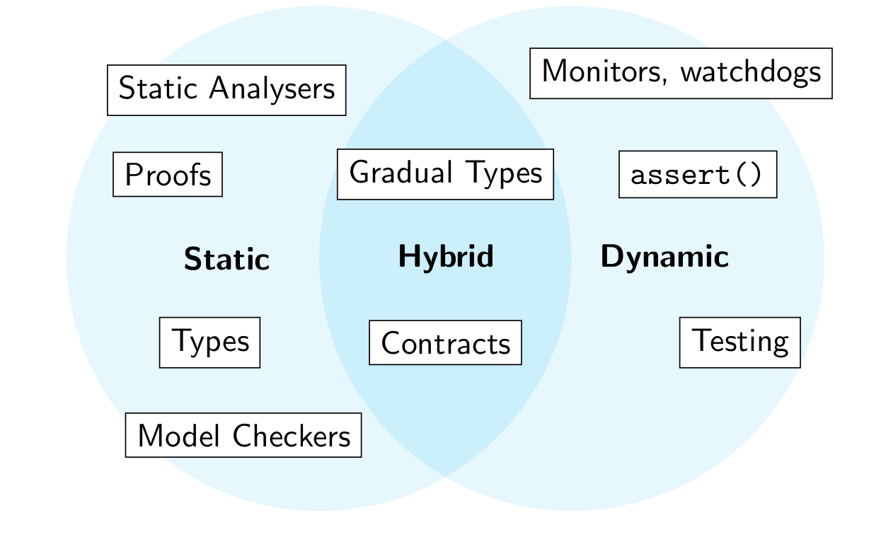

# Static Assurances with Types

Methods of assurance:



Static means of assurance analyses a program ***without running it***

## Static vs. Dynamic

Static checks can be **exhaustive**

> An exhaustive check is a check that is able to analyse all possible executions of a program.

However, some properties cannot be checked statically in general (halting problem), or are intractable to feasibly check statically (state space explosion).

Dynamic checks cannot be exhaustive, but can be used to check some properties where static methods are unsuitable.

## Types

Most static and all dynamic methods of assurance are **not** integrated into the compilation process.

* You can compile and run your program even if it fails tests
* You can change your program to diverge from your model checker model
* Your proofs can diverge from your implementation

Because type are integrated into the compiler, they cannot diverge from the source code. This means that type signatures are a kind of *machine-checked documentation* for your code.

Types are the most widely used kind of formal verificaiton in programming today.

* They are checked automatically by the compiler
* They can be extended to encompass properties and proof systems with very high expressivity (see [here](TODO))
* They are an **exhaustive** analysis

We will be looking a techniques to encode various correctness conditions inside Haskell's type system

## Phantom Types

> A type parameter is **phantom** if it does not appear in the right hand side of the type definition  
> `newtype Size x = S Int`

Let's examine each one of the following use cases:

* We can use this parameter to track what **data invariants** have been established about a value
* We can use this parameter to track information about the representation (e.g. units of measure
* We can use this parameter to enforce an **ordering** of operations performed on these values (**type state**)

### Validation

``` hs
data UG -- empty type
data PG
data StudentID x = SID Int
```

We can define a **smart constructor** that specialises the type parameter:

``` hs
sid :: Int -> Either (StudentID UG) (StudentID PG)
-- recall
data Either a b = Left a | Right b
```

and define functions:

``` hs
enrollInCOMP3141 :: StudentID UG -> IO ()
lookupTranscript :: StudentID x -> IO String
```

### Units of Measure

In 1999, software confusing units of measure (pounds and newtons) caused a Mars orbiter to burn up in atmospheric entry

``` hs
data Kilometers
data Miles
data Value x = U Int
sydneyToMelbourne = (U 877 :: Value Kilometers) -- tagged with type level distinction
losAngelesToSanFran = (U 383 :: Value Miles)    -- ^
```

In addition to tagging values, we can also enforce constraints on unit:

``` hs
data Square a
area :: Value m -> Value m -> Value (Square m)
area (U x) (U y) = U (x * y)
```

Note the arguments to `area` must have the same units

### Type State

Examples: A `Socket` can either be read to receive data, or busy. If the socket is busy, the user must first use the `wait` operation, which blocks until the socket is ready. If the socket is ready, the user can use the send operation to send string data, which will make the socket busy again.

``` hs
data Busy
data Ready
newtype Socket s = Socket ... -- the implementation is not important

wait :: Socket Busy -> IO (Socket Ready)
send :: Socket Ready -> String -> IO (Socket Busy)
```

The previous code assumes that we don't re-use old `Socket`s

``` hs
-- expected linear usage
send2 :: Socket Ready -> String -> String -> IO (Socket Busy)
send2 s x y = do s' <- send s x
                 s'' <- wait s'
                 s''' <- send s'' y
                 pure s'''
```

But, we can just re-use old values to send without waiting:

``` hs
send2' s x y = do _ <- send s x
                  s' <- send s x
                  pure s'
```

**Linear type** systems can solve this, but not in Haskell (yet)

### Datatype Promotion

Defining empty data types for our tags is **untyped**. We can have `StudentID UG`, but also `StudentID String`.

Recall that Haskell types themselves have types, called kinds. We can make our tag types more precise than `*` using the `DataKings` language extension, which lets us use data types as kinds:

``` hs
{-# LANGUAGE DataKinds, KindSignatures #-}
data Stream = UG | PG
data StudentID (x :: Stream) = SID Int
-- rest as before
```

## GADTS

### Motivation

For the given types:

``` hs
data Expr = BConst Bool
          | IConst Int
          | Times Expr Expr
          | Less Expr Expr
          | And Expr Expr
          | If Expr Expr Expr
data Value = BVal Bool | IVal Int
```

we can define an expression calculator
