# Theory of Types

## Recap: Logic

### Natural Deduction

We can specify a logical system as a **deductive system** by providing a set of *rules* and *axioms* that describe how to prove various connectives

Each connective typically has ***introduction*** and ***elimination*** rules.  
For example, to prove an implication A -> B holds, we must show that B holds assuming A. this introduction rule is written as:

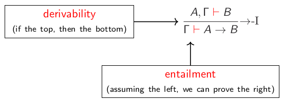

Implication also has an elimination rule, that is also called **modus ponens**:

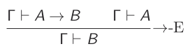

Conjunction (and) has an introduction rule that follows our intuition:

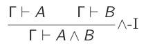

It has **two** elimination rules:

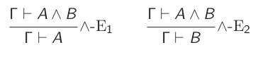

Disjunction (or) has two introduction rules:

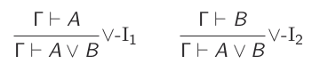

Disjunction elimination is a little unusual:

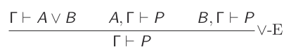

The true literal, written ⊤, has only an introduction:

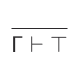

And false, written ⊥, has just elimination (**ex falso quodlibet**):

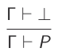

Examples:  
Prove:

* A ∧ B → B ∧ A (A and B implies B and A)

    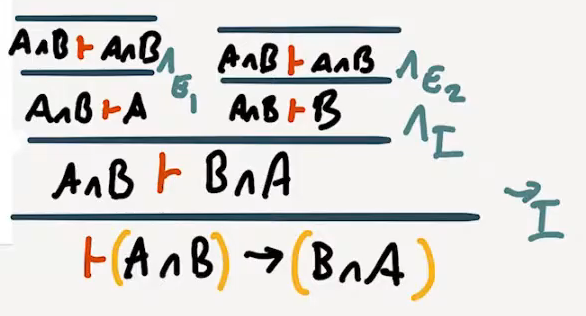

    This can also be written as

    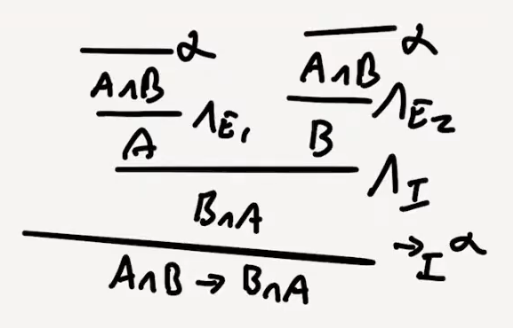

* A ∨⊥→ A (A or true implies A)

    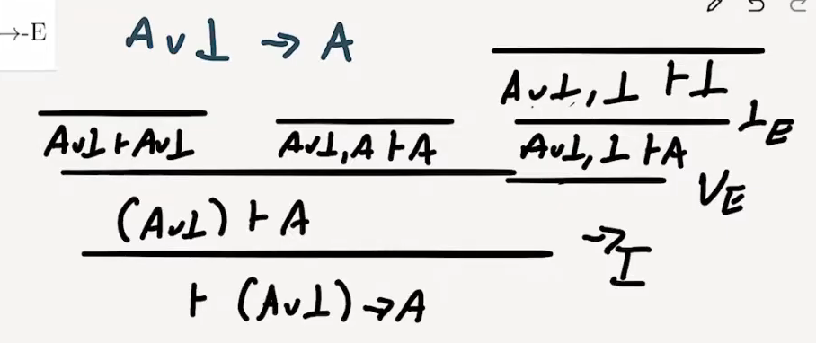

Typically we define **negation** as ¬A ≡ (A → ⊥); not a is equivalent to A implies false.

### Constructive Logic

The logic we have expressed so far does **not** admit the *law of the excluded middle*:  
**P ∨ ¬P**  
Or the equivalent double negation elimination:  
**(¬¬P) → P**

This is because it is a **constructive** logic that does not allow us to do proof by contradiction.

## Typed Lambda Calculus

The theoretical properties we will describe also apply to Haskell, but we need a smaller language for demonstration purposes:

* No user-defined types, just a small set of built-in types
* No polymorphism (type variables)
* Just lambdas (λx.e) to define functions or bind variables

This language is a very minimal functional language, called the ***simply typed lambda calculus***.

Out small set of built-in types are intended to be enough to express most of the data types we would otherwise define.  
We are going to use logical inference rules to specify how expressions are given types (**typing rules**)

### Function Types

We create a function type A -> B using lambda expressions:

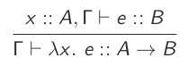

The typing rule for ***function application*** is as follows:

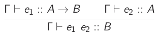

### Composite Data Types

In addition to functions, most programming languages feature ways to ***compose*** types together to produce new types, such as Classes, Tuples, Unions, Records, Structs

#### Product types

If we want to store two things in one value, we can accomplish this in typed lambda calculus with with tuples.

``` hs
(A, B)
```

These types are also called **product types**.

We won't have type declarations, named fields or anything like that. More than two values can be combined by nesting products, for example a three dimensional vector: `(Int, (Int, Int))`

#### Constructors and Eliminators

We can ***construct*** a product type the same as Haskell tuples:

[product construct](../imgs/09-12_product-construct.png)

The only way to extract each component of the product is to use the `fst` and `snd` eliminators:

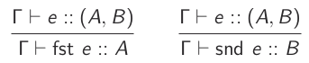

#### Unit Types

Currently, we have no way to express a type with just *one* value. This may seem useless at first, but it becomes useful in combination with other types.  
We will introduce the **unit** type from Haskell, written `()`, which has exactly one inhabitant, also written `()`:

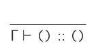

### Disjunctive Composition

We can't, with the types we have, express a type with exactly *three* values. Example:

``` hs
data TrafficLight = Red | Amber | Green
```

In general, we want to express data that can be *one* of multiple *alternatives*, that contain different bits of data.

Example of more elaborate alternatives:

``` hs
type Length = Int
type Angle = Int
data Shape = Rect Length Length
           | Circle Length
           | Point
           | Triangle Angle Angle Length
```

This is awkward in many languages; in Java we'd have to use inheritance, in C we'd have to use unions.

#### Sum Types

We'll build in the Haskell `Either` type to express the possibility that data may be one of two forms.

``` hs
Either A B
```

These types are also called **sum types**.

Our `TrafficLight` type can be expressed as a sum of units:

``` hs
TrafficLight ≃ Either () (Either () ())
```

#### Constructors and Eliminators for Sums

To make a value of type `Either A B`, we invoke one of the two ***constructors***:

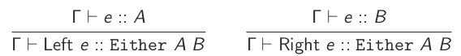

We can branch based on which alternative is used using ***pattern matching***:

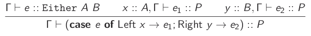

Example: Our traffic light type has three values as required:

``` hs
TrafficLight ≃ Either () (Either () ())

Red   ≃ Left ()
Amber ≃ Right (Left ())
Green ≃ Right (Right ())
```

#### The Empty Type

We add another value, called `Void`, that has *no* inhabitants. Because it is empty, there is no way to construct it.  
We do have a way to eliminate it:

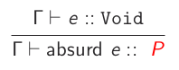

If I have a variable of the *empty* type in scope, we must be looking at an expression that will **never** be evaluated. Therefore, we can assign any type we like to this expression, because it will never be executed.

### Gathering Rules

If we gather all the rules be have generated and remove the terms

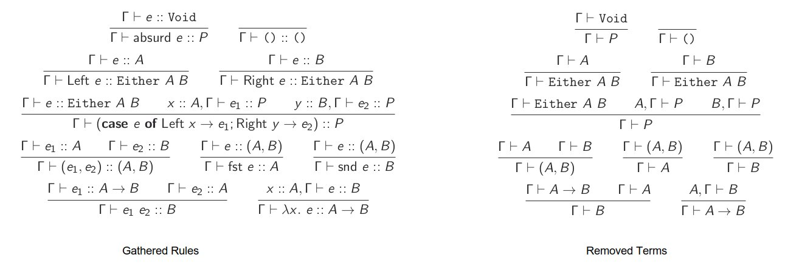

It looks **exactly** like constructive logic.  
If we can construct a program of a certain type, we also create a proof of a proposition that corresponds to that type.

### The Curry-Howard Correspondence

This correspondence goes by many names, but it is usually attributed to Haskell Curry and William Howard.  
It is a *very deep* result:

| Programming | Logic                |
| ---         | ---                  |
| Types       | Propositions         |
| Programs    |  Proofs              |
| Evaluation  | Proof Simplification |

It turns out, no matter what logic you want to define, there is always a corresponding λ-calculus, and vice versa.

| Programming                 | Logic            |
| ---                         | ---              |
| Continuations               | Classical Logic  |
| Monads                      | Modal Logic      |
| Linear Types, Session Types | Linear Logic     |
| Region Types                | Separation Logic |

Examples:

* Commutativity of conjunction - proves A ∧ B → B ∧ A

    ``` hs
    andComm :: (A, B) -> (B, A)
    andComm p = (snd p, fst p)
    ```

* Transitivity of implication - is just function composition

    ``` hs
    transitive :: (A -> B) -> (B -> C) -> (A -> C)
    transitive f g x = g (f x)
    ```

### Translating

We can translate logical connective to types and back:

| Types     | Logical Connectives |
| ---       | ---                 |
| Tuples    | Conjunction (∧)     |
| `Either`  | Disjunction (∨)     |
| Functions | Implication         |
| `()`      | True                |
| `Void`    | False               |

### Proof Simplification

We can also translate our *equational reasoning* on programs into **proof simplification** on proofs.

Assuming A ∧ B, we want to prove B ∧ A.  
We have this unpleasant proof:

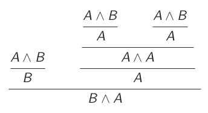

Translating to types, we get:  
Assuming `x :: (A, B)`, we want to construct `(B, A)`

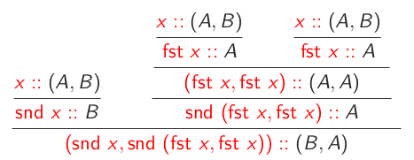

We know that `(snd x, snd (fst x, fst x)) = (snd x, fst x)`, so we can simplify our proof.

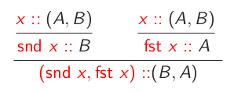

Then convert back to logic:

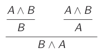

### Applications

As mentioned before, in dependently typed languages such as Agda and Idris, the distinction between value-level and type-level languages is removed, allowing us to refer to our program in types (i.e. propositions) and then construct programs of those types (i.e. proofs)

Generally, dependent types allow us to use rich types not just for programming, but also for verification via the Curry-Howard correspondence.

### Caveats

All functions we define have to be **total** and **terminating**.  
Otherwise, we get an ***inconsistent*** logic that lets us prove false things.

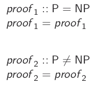

Most common calculi corresponds to constructive logic, not classical one, so principle like the law of excluded middle or double negation elimination do **not** hold: ¬¬P → P

## Algebraic Type Isomorphism

### Semiring Structure

These types we have defined form an algebraic structure called **commutative semiring**

Laws for `Either` and `Void`:

* Associativity: `Either (Either A B) C ≃ Either A (Either B C )`
* Identity: `Either Void A ≃ A`
* Commutativity: `Either A B ≃ Either B A`

Laws for tuples and 1:

* Associativity: `((A, B), C) ≃ (A, (B, C))`
* Identity: `((), A) ≃ A`
* Commutativity: `(A, B) ≃ (B, A)`

Combining the two:

* Distributivity: `(A, Either B C) ≃ Either (A, B) (A, C)`
* Absorption: `(Void, A) ≃ Void`

What does ≃ mean here? It's more than logical equivalence.  
We can consider two things to be equivalent if *the number of possible value in either of those types is them same*

``` hs
| (A, B) | = |A| * |B| -- e.g |((), Bool)| = 2 and |(Bool, Bool)| = 4
| Either A B | = A + B
| () | = 1
| Void | = 0
| A -> B | = |B|^|A|
```

### Isomorphism

To type `A` and `B` are **isomorphic**, written `A ≃ B`, if there exists a **bijection** between them. This means that for each value in A, we can find a unique value in B and vice versa.

We can use this reasoning to simplify type definitions. For example:

``` hs
data Switch = On Name Int
            | Off Name
≃ Either (Name, Int) Name
≃ Either (Name, Int) ((), Name)  -- tuple identity
≃ Either (Name, Int) (Name, ())  -- tuple commutativity
≃ (Name , Either Int ())         -- distributivity
≃ (Name, Maybe Int)

-- this can also be mathematically prepresented
≃ Name * Int + Name
≃ Name * Int + 1 * Name
≃ Name * Int + Name * 1
≃ Name * (Int + 1)
```

Representing data types generically as sums and products is the foundation for **generic programming** libraries such as GHC generics. This allows us to define algorithms that work on arbitrary data structures.

## Polymorphism and Parametricity

The type quantifier ∀ corresponds to the universal quantifier ∀, but it is **not** the same as ∀ from first-order logic.  
First-order logic quantifiers range over a set of ***individuals*** or values, for example the natural numbers: ∀x, x + 1 > x

These quantifiers range over **propositions** (types themselves). It is analogous to **second-order logic**, not first-order:

∀A. ∀B. A ∧ B → B ∧ A
∀A. ∀B. (A, B) → (B, A)

The first-order quantifier has a type-theoretic analogue too (type indices), but this is not nearly as common as polymorphism

### Generality

If we need a function of type `Int -> Int`, a polymorphic function has type ∀a. a → a will do just fine, we can just instantiate the type variable to `Int`. But the reverse is not true. This gives rise to ordering.

A type A is ***more general*** than type B, often written A ⊑ B, if type variables in A can be instantiated to give the type B.

Example:

``` txt
least general                    most general
Int -> Int ⊒ ∀z. z → z ⊒ ∀x y . x → y ⊒ ∀a. a
```

Polymorphic type signatures constrain implementations.  
The ***more*** general our type gets, the ***less*** implementations we have.

### Parametricity

The principle of **parametricity** states that the result of polymorphic functions cannot depend on values of an abstracted type.  
More formally, suppose I have a polymorphic function *g* that is polymorphic on type *a*. If we run any arbitrary function *f :: a-> a* on all the *a* values in the input of *g*, that will give the same result as running *g* first, then *f* on all the *a* values of the output.

Examples: find the parametricity theorems for the following functions

* `foo :: ∀a. [a] → [a]`  
We know that **every** element of the output occurs in the input.  
The parametricity theorem we get is, for all *f*:

    ``` hs
    foo . (map f) = (map f) . foo
    ```

* `head :: ∀a. [a] → a`  
For any *f*:

    ``` hs
    f (head ls) = head . (map f ls)
    ```

* `(++) :: ∀a. [a] → [a] → [a]`  
For any *f*:

    ``` hs
    map f (xs ++ ys) = (map f xs) ++ (map f ys)
    ```

* `concat :: ∀a. [[a]] → [a]`  
For any *f*:

    ``` hs
    map f (concat ls) = concat (map (map f) ls)
    ```

* `filter :: ∀a. (a → Bool) → [a] → [a]`  
We'll need to compose *f* with the predicate *p* in case the results depend on *f*.
For any *f*:

    ``` hs
    filter p (map f ls) = map f (filter (p . f) ls)
    ```

Parametricity theorems can be mechanically derived using the **relational parametricity** framework invented by John C. Reynolds, and popularised by Walder in "[Theorems for Free!](https://people.mpi-sws.org/~dreyer/tor/papers/wadler.pdf)"  
We can also ask `lambdabot` on the Haskell IRC channel for these theorems
